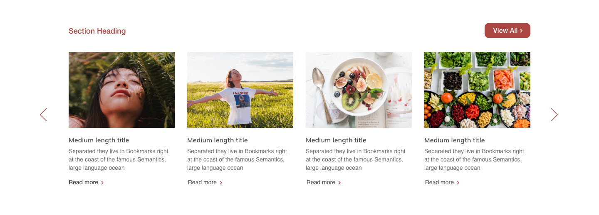

# Gutenberg blocks using ACF

The development of two custom Gutenberg blocks using ACF. Both blocks must make
use of plain CSS and **vanilla javascript** when custom functionality is required.
The production theme is based on Bootstrap 5, so please use Bootstrap 5 for
templating classes and CSS variables.

## Useful links

- [Splide](https://splidejs.com)
- [Bootstrap 5](https://getbootstrap.com/docs/5.0/getting-started/introduction/)
- [Fontawesome 5](https://fontawesome.com)
- [ACF block documentation](https://www.advancedcustomfields.com/resources/blocks/)

## File structure

The following file structure should be used, these will be the files that needs
to be sent back to us.

- partials (folder, in theme root.)
	- blocks.php (file, code for block registration and field. Will be included in themes functions.php)
	- blocks (folder)
		- home (folder)
			- posts-carousel.php
			- posts-carousel.css
			- posts-carousel.js
			- features-carousel.php
			- features-carousel.css
			- features-carousel.js

## Code examples

Please check the code examples inside the `code-examples` folder in this repo, just for
reference.

## The required blocks

### Block A

This block will show a carousel list of post items. The user can select the
category (optional) and the amount of posts to show in the carousel, limited to
24.

This block will also have a button on the top right, that will link to the
related archive.

#### Features:

- Can select the category or show all posts.
- Can define how many posts to show, limited to 24.

Please follow the below design for this block:

### Block B

This block will allow clients to select a specific topic from a carousel
list. The selected item should always be centered. After an item is selected
it's related blocks will be shown.

- [Functionality Example](https://www.qhms.com/home/index.aspx?lang=tc)

Please follow the below design for this block:

The field structure should be something like the below list.

#### Block B field structure

- Topics (Repeater):
	- Title
	- Icon (Font Awesome 5)
	- Topic Blocks (Repeater)
		- Title
		- Icon (FontAwesome 5)
		- Description
		- Link
		- Image
